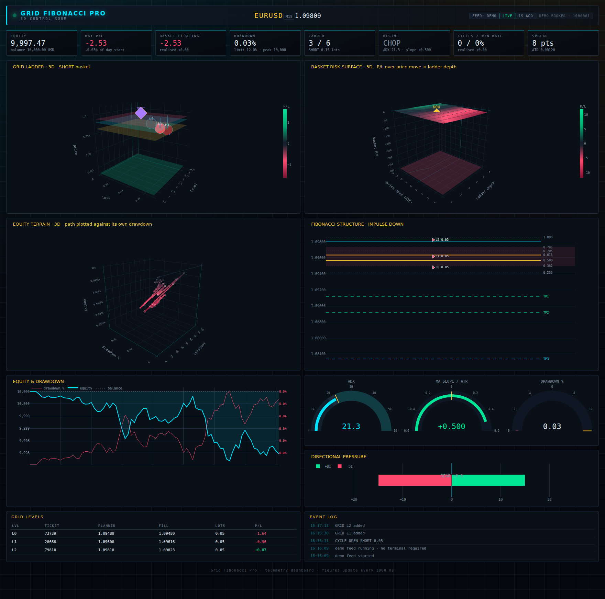

# Grid Fibonacci Pro — 3D control room

A live dashboard for the `mt5/GridFibonacciEA` Expert Advisor. Dark, neon, and
built around three 3D views that each answer a different question about a grid
basket.



## Run it

```bash
pip install -r requirements.txt

python app.py --demo                    # synthetic market, no terminal needed
python app.py                           # wait for EA telemetry on /ingest
python app.py --mt5 --symbol XAUUSD     # read a local MT5 terminal directly
python app.py --host 0.0.0.0 --ingest-key SECRET   # accept a remote EA
```

Then open <http://127.0.0.1:8050>.

Start with `--demo`. It runs a synthetic market that opens, extends and closes
grid cycles, so every panel has something real to draw before you connect a
terminal.

## Connecting the EA

1. In the EA inputs, section **12**:
   - `InpTelemetryOn` = `true`
   - `InpTelemetryUrl` = `http://<dashboard host>:8050/ingest`
   - `InpTelemetryKey` = the same value you passed to `--ingest-key` (optional)
   - `InpTelemetrySeconds` = `5`
2. In MetaTrader 5: **Tools → Options → Expert Advisors → Allow WebRequest for
   listed URL**, and add that URL. Without it every push returns −1 / error
   4014, and the EA logs exactly that.

The EA posts from `OnTimer`, never from `OnTick`, because `WebRequest` blocks.
Telemetry is disabled in the Strategy Tester, where `WebRequest` does not exist.

`GET /health` reports the active feed and how long ago the last snapshot
arrived — useful as a container health check.

## The three 3D views

**GRID LADDER** — where the money is right now. One stem per filled level:
height is the fill price, depth is the lot size, colour is that level's P/L.
Each stem drops to the shared basket stop, so the distance to invalidation is a
length you can see rather than a number to subtract. Translucent planes mark
the basket average, the market, the final target and the stop; a violet diamond
marks the level the EA plans to fill next.

**BASKET RISK SURFACE** — what happens next, and the reason this dashboard is
3D at all. P/L over two axes: how far price moves (in ATR), and how deep the
ladder is allowed to get. Levels not yet filled are included only where price
would actually have reached them, so the surface shows the real convexity of a
grid — the fold where further adverse movement starts filling levels and
bending the P/L curve — instead of the straight line a single position would
give. A translucent red floor marks the cycle's loss ceiling. The gold **NOW**
marker is the live basket.

**EQUITY TERRAIN** — where the account has been. The equity path plotted
against its own drawdown, coloured by floating P/L and thickened by ladder
depth, so a recovering curve and a deteriorating one are different *shapes*
rather than the same line at different heights.

Alongside them: the Fibonacci structure as a price ladder, equity and drawdown,
ADX / slope / drawdown gauges, directional pressure, the live level table and
an event log.

## The feeds

| Feed | How it arrives | Where it works |
|---|---|---|
| `ea` | The EA POSTs JSON to `/ingest` | Anywhere — a Linux VPS included |
| `mt5` | This process polls a local terminal via the `MetaTrader5` package | Windows, terminal running |
| `demo` | Synthetic generator | Anywhere |

All three write the identical snapshot shape into `store.py`, which is the only
thing the figures read. Adding a feed never touches rendering code.

The `mt5` feed recomputes the same structure the EA sees — EMA stack, Wilder
ATR and ADX, ATR-normalised slope, confirmed pivots and the Fibonacci geometry
— from the terminal's own bars. It is a second opinion on the EA's view, not a
copy of it, which makes it useful for spotting an EA reading stale history.
It needs `pip install MetaTrader5` (commented out in `requirements.txt`
because the package is Windows-only).

## Files

| File | Contains |
|---|---|
| `app.py` | Dash layout, the single refresh callback, `/ingest` and `/health`, the CLI |
| `figures.py` | Every figure; the projection maths behind the risk surface |
| `sources.py` | The MT5 and demo feeds, plus a small indicator kit (EMA, Wilder, ATR, ADX, pivots) |
| `store.py` | The thread-safe snapshot store and history ring buffers |
| `theme.py` | The palette and the shared Plotly template |
| `assets/style.css` | The shell — Dash serves anything in `assets/` automatically |

Colours are defined twice on purpose — `theme.py` for figures, `style.css` for
the shell — because Plotly and CSS cannot share variables. Change both together.

## Notes

- The store is memory-only. Restarting the dashboard starts the history over;
  the EA's own statistics survive because they come with each snapshot.
- `--host 0.0.0.0` exposes the ingest endpoint to your network. Set
  `--ingest-key` (or the `GFEA_INGEST_KEY` environment variable) when you do.
- This is a development server. Behind a real deployment, run it under a WSGI
  server against `app.server` and terminate TLS in front of it.
